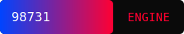

###### README.md >> markdown

<p align="left">
  
</p>

# 🟦 p f 31
<p align="center">
**Version Quantum Era**
</p>

<p align="center">
  
</p>

<h1 align="center">
  <span style="font-family:Consolas,Monaco,'Courier New',monospace;font-weight:900;font-size:48px;letter-spacing:4px;color:#ff0033;text-shadow:0 0 12px #ff0033,0 0 24px #ff0033;display:inline-block;">
    X X X X X
  </span>
</h1>

<p align="center">
  <strong>Cyber‑Physical Modular Architect • Quantum Era Engineer • RedHat‑Ops Developer</strong><br/>
</p>

###### Créateur de moteurs modulaires, systèmes tactiques, pipelines CI/CD et environnements Codespaces avancés.

---

### 🛡️ Badges Cyber‑Physiques
>SVG animés

<p align="left">
  
</p>

```md
> Badges SVG premium, animés (SMIL + CSS inline), style Quantum‑Era / RedHat hacker.  
> Optimisés pour GitHub, compatibles Markdown pur.
```

---

### 🚀 Qui je suis
- Développeur d’ingénierie avancée
- architecte cyber-physique
- Créateur de moteurs modulaires et explorateur des environnements tactiques
>Je construis des systèmes :
```md
- robustes
- scalables
- automatisés
- techniques
```

>Mon univers :
```md
> Python, Bash, architectures modulaires  
> Systèmes embarqués & ECU  
> CI/CD & GitHub Actions  
> Devcontainers & Codespaces  
> Bots GitHub & automatisation  
> Environnements tactiques opérationnels  
```

---

### ⚙️ Fonctionnalités clés
- 🛰️ Architectures modulaires multi‑systèmes  
- 🧩 Pipelines d’ingénierie avancés  
- 🛡️ Systèmes cyber‑physiques simulés  
- 🔧 Moteurs logiciels nouvelle génération  
- 🧬 Badges SVG animés Quantum Era  
- 🤖 Bots GitHub autonomes  
- 🧱 Devcontainers tactiques  
- 🔥 Pipelines CI/CD full‑stack  

---

### 🧠 Ce que je construis
```md
- YnFOR — moteur modulaire nouvelle génération  
- 98731 — architecture d’ingénierie optimisée pour Codespaces  
- VLX‑16S — simulateur tactique embarqué  
- OmniverseCORE — framework multi‑systèmes Quantum Era  
- YnFOR-Bot — automatisation intelligente GitHub  
- Badges SVG animés — cyber‑ops / RedHat hacker  
```

---

##$ 🧰 Technologies
```bash
Python 3.12+
GitHub Actions / CI/CD
Devcontainers / Codespaces
Architectures modulaires
Systèmes embarqués & ECU
HTML / CSS / SVG animés
Bots GitHub
Sécurité & cyber‑ingénierie
```

---

### 🧬 Architecture (ASCII)
```schema                ┌──────────────────────────────┐
                │        Quantum Era v6.0       │
                └──────────────┬───────────────┘
                               │
        ┌──────────────────────┴──────────────────────┐
        │                                             │
   [ Core Engine ]                               [ Cyber Modules ]
        │                                             │
   ┌────┴────┐                                   ┌────┴────┐
   │ Pipelines│                                   │  Plugins │
   └────┬─────┘                                   └────┬─────┘
        │                                             │
   [ CI/CD ]                                     [ Bots GitHub ]
```

---

### ⚡ Installation & Quickstart
>Devcontainer
```bash
gh codespace create -r teremuhamblin/98731
```
>Local
```bash
git clone https://github.com/teremuhamblin/98731
cd 98731
```

---

### 🔄 CI/CD & Automations
- Builds automatisés  
- Tests intégrés  
- Release pipelines  
- Bots GitHub  
- Analyse statique  
- Packaging multi‑plateforme  

---

### 🗺️ Roadmap 
>Quantum Era
- (v1.0 → v6.0)
```md
- [x] v1.0 — Base Engine  
- [x] v2.0 — Modular Core  
- [x] v3.0 — CI/CD Full  
- [x] v4.0 — Cyber‑Ops Layer  
- [x] v5.0 — RedHat Hacker Mode  
- [x] v6.0 — Quantum Era Release  
```

---

### 📜 Changelog
>résumé
```md
v6.0 — Quantum Era  
- Nouveau moteur modulaire  
- Badges SVG animés  
- Architecture cyber‑physique  
- Pipelines CI/CD renforcés  
```

---

### 📚 Documentation
- Wiki GitHub  
- GitHub Pages  
- Glossaire technique  
- Diagrammes & pipelines  

---

### 📄 Licence
The Unlicence
>Libre, propre, professionnelle.

---

### ✨ Footer

<p align="center">
  <sub>Maintenu avec passion — et parfois par mes bots autonomes.</sub>
</p>

---
